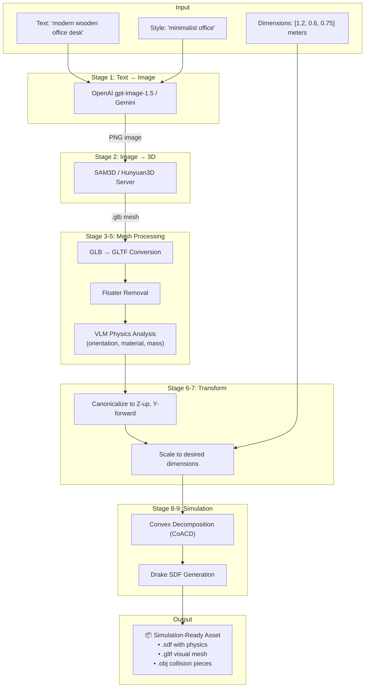

# SceneSmith: Text → 3D Model Pipeline for Static Objects

## Overview

SceneSmith's pipeline converts a **text description** of a static object into a **simulation-ready 3D model** (Drake SDF) through a 7-stage process. The pipeline is orchestrated by the [`AssetManager`](file:///c:/Users/adama/Documents/reefsmith/reefsmith/agent_utils/asset_manager.py) class.

```mermaid
flowchart LR
    A["📝 Text\nDescription"] --> B["🖼️ Image\nGeneration"]
    B --> C["🧊 Image → 3D\nGeometry"]
    C --> D["🔧 GLB → GLTF\nConversion"]
    D --> E["🧹 Floater\nRemoval"]
    E --> F["👁️ VLM Physics\nAnalysis"]
    F --> G["📐 Mesh\nCanonicalization"]
    G --> H["📏 Scale to\nDimensions"]
    H --> I["💥 Collision\nDecomposition"]
    I --> J["📦 Drake SDF\nGeneration"]
    J --> K["🎮 Simulation-Ready\nAsset"]
```



---

## Stage 1: Text → Image

**Module**: [image_generation.py](file:///c:/Users/adama/Documents/reefsmith/reefsmith/agent_utils/image_generation.py)

The object description (e.g., `"modern wooden office desk"`) is combined with a **style prompt** (e.g., `"modern minimalist kitchen"`) and sent to an image generation API to produce a reference image.

**Two backends are supported:**

| Backend | Model | API |
|---------|-------|-----|
| **OpenAI** (default) | `gpt-image-1.5` | `images.generate()` |
| **Gemini** | `gemini-3-pro-image-preview` | `models.generate_content()` |

The prompt is constructed from templates in `reefsmith/prompts/` using `ImageGenerationPrompts.ASSET_IMAGE_INITIAL`. Multiple images are generated **in parallel** via `ThreadPoolExecutor`.

**Output**: A PNG image of the object on a neutral background (1024×1024).

---

## Stage 2: Image → 3D Geometry

**Module**: [geometry_generation.py](file:///c:/Users/adama/Documents/reefsmith/reefsmith/agent_utils/geometry_generation_server/geometry_generation.py)

A geometry generation server takes the reference image and produces a textured 3D mesh (GLB format).

**Two backends are supported:**

| Backend | Quality | GPU Memory | Notes |
|---------|---------|------------|-------|
| **SAM3D** ⭐ (paper default) | Higher | ≥32 GB | Uses SAM3 + SAM 3D Objects checkpoints |
| **Hunyuan3D-2** | Lower | ≥24 GB | Proof-of-concept only |

### SAM3D Path
Configured via [sam3d_pipeline_manager.py](file:///c:/Users/adama/Documents/reefsmith/reefsmith/agent_utils/geometry_generation_server/sam3d_pipeline_manager.py):
1. Load image → RGB
2. Run SAM3 segmentation (foreground or object-description mode)
3. Generate 3D mesh from segmented object using SAM 3D Objects model
4. Export as GLB

### Hunyuan3D Path
Configured via [hunyuan3d_pipeline_manager.py](file:///c:/Users/adama/Documents/reefsmith/reefsmith/agent_utils/geometry_generation_server/hunyuan3d_pipeline_manager.py):
1. Load image → RGBA → remove background
2. Shape generation (`num_inference_steps=5`, `octree_resolution=256`)
3. Face reduction
4. Texture generation
5. Export as GLB

The server runs as an HTTP service (port 7000) with **multi-GPU worker pool** — one worker process per GPU for parallel generation across scenes.

**Output**: A textured `.glb` mesh file.

---

## Stage 3: GLB → GLTF Conversion

**Where**: [_convert_mesh_to_simulation_asset()](file:///c:/Users/adama/Documents/reefsmith/reefsmith/agent_utils/asset_manager.py#L1784-L1962)

The GLB file is converted to **GLTF with separate textures** using Blender (via `BlenderServer`). This is required because Drake needs GLTF with external texture files, not embedded ones.

```
BlenderServer.convert_glb_to_gltf(input, output, export_yup=True)
```

**Output**: `.gltf` file + separate texture files, in Y-up coordinate system.

---

## Stage 4: Floater Removal

Disconnected mesh fragments ("floaters") from the generation process are removed using a volume-based threshold:

```python
remove_mesh_floaters(mesh_path, output_path, distance_threshold=...)
```

This cleans up stray geometry that could affect physics simulation.

---

## Stage 5: VLM Physics Analysis

**Module**: [mesh_physics_analyzer.py](file:///c:/Users/adama/Documents/reefsmith/reefsmith/agent_utils/mesh_physics_analyzer.py)

A **Vision-Language Model** (VLM) analyzes multi-view renders of the mesh to determine:

| Property | Example |
|----------|---------|
| **Up axis** | `+Z`, `+Y`, `-X`, etc. |
| **Front axis** | `+Y`, `-Z`, etc. |
| **Material** | `"wood"`, `"metal"`, `"ceramic"` |
| **Mass (kg)** | `15.0` |
| **Mass range (kg)** | `[10.0, 20.0]` |

The analysis pipeline:
1. Render **multi-view images** of the mesh in Blender (N side views at configurable elevation + optional top/bottom views)
2. Send images to VLM with physics analysis prompt
3. Parse structured response into `MeshPhysicsAnalysis`

The material determines **friction coefficient** and the mass is used for **inertia computation**.

---

## Stage 6: Mesh Canonicalization

**Module**: [mesh_canonicalization.py](file:///c:/Users/adama/Documents/reefsmith/reefsmith/agent_utils/mesh_canonicalization.py)

The mesh is rotated to SceneSmith's **canonical orientation**:
- **Z-up** (vertical axis)
- **Y-forward** (front-facing direction)

Using the VLM-determined up/front axes, Blender applies the necessary rotation transform.

---

## Stage 7: Scale to Desired Dimensions

**Module**: [mesh_utils.py](file:///c:/Users/adama/Documents/reefsmith/reefsmith/agent_utils/mesh_utils.py)

If the agent specified `desired_dimensions` (width, depth, height in meters), the mesh is **uniformly scaled** to best-fit those dimensions:

```python
scale_mesh_uniformly_to_dimensions(mesh_path, desired_dimensions, output_path, ...)
```

The scaling preserves aspect ratio — it finds the single uniform scale factor that best matches all three target dimensions.

---

## Stage 8: Collision Geometry (Convex Decomposition)

**Module**: [convex_decomposition_server](file:///c:/Users/adama/Documents/reefsmith/reefsmith/agent_utils/convex_decomposition_server)

The visual mesh is decomposed into **convex pieces** for efficient physics collision detection:

| Method | Description |
|--------|-------------|
| **CoACD** (default) | Approximate Convex Decomposition — tighter collision fits |
| **V-HACD** | Volumetric HAC Decomposition — sometimes faster simulation |

This runs as a separate server process and returns a list of `trimesh.Trimesh` convex hulls.

---

## Stage 9: Drake SDF Generation

**Module**: [sdf_generator.py](file:///c:/Users/adama/Documents/reefsmith/reefsmith/agent_utils/sdf_generator.py#L42-L248)

Everything is packaged into a [Drake](https://drake.mit.edu/) **SDF (Simulation Description Format)** file:

```xml
<sdf version="1.7">
  <model name="office_desk">
    <link name="base_link">
      <!-- Inertial: mass, center of mass, inertia tensor -->
      <inertial>
        <mass>15.000000</mass>
        <pose>0.1 0.0 0.3 0 0 0</pose>
        <inertia>
          <ixx>...</ixx> <iyy>...</iyy> <izz>...</izz>
          <ixy>...</ixy> <ixz>...</ixz> <iyz>...</iyz>
        </inertia>
      </inertial>
      <!-- Visual: textured GLTF mesh -->
      <visual name="visual">
        <geometry><mesh><uri>office_desk.gltf</uri></mesh></geometry>
      </visual>
      <!-- Collision: convex decomposition pieces -->
      <collision name="collision_0">
        <surface><friction><ode><mu>0.5</mu></ode></friction></surface>
        <geometry><mesh>
          <uri>office_desk_collision_0.obj</uri>
          <drake:declare_convex/>
        </mesh></geometry>
      </collision>
      <!-- ... more collision pieces ... -->
    </link>
  </model>
</sdf>
```

Key physics properties computed:
- **Mass**: From VLM estimate
- **Density**: `mass / mesh_volume`
- **Inertia tensor**: From trimesh moment of inertia × density
- **Center of mass**: From mesh geometry
- **Friction**: Looked up from material type (wood=0.5, metal=0.3, etc.)
- **Coordinate transform**: Visual mesh Y-up → collision mesh Z-up (Drake convention)

The inertia tensor is validated (positive eigenvalues) and fixed for triangle inequality violations.

---

## Summary: End-to-End Flow



> [!TIP]
> When the **Asset Router** is enabled (default), an LLM first analyzes each request to split composite objects (e.g., "desk with lamp" → separate desk + lamp), select the best generation strategy (generated vs. HSSD retrieval vs. articulated retrieval), and validate results with VLM before the conversion pipeline runs.
